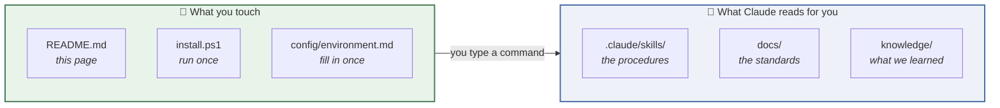
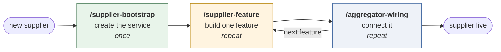

# Supplier Integration Engineering System

Build a flight-supplier API integration by describing what you want. The system supplies the
standards, the procedure, and the discipline to stop and ask when something is genuinely unknown.

Built for [Claude Code](https://claude.com/claude-code). Works with any agent that reads
`AGENTS.md`.

---

## You only need three things

Everything else in this repository is read **by Claude, for you**. You never open it.



If you read nothing else, read
**[`docs/permission-boundaries.md`](docs/permission-boundaries.md)** — the one page that stops
you breaking something shared.

---

## Setup — once, about five minutes

```bash
git clone <this-repo-url>
cd supplier-integration-engineering-system
```

```powershell
.\install\install.ps1
```

```bash
cp config/environment.example.md config/environment.md   # then fill it in
```

**Check it worked:** open Claude Code anywhere, type `/`. Four commands should appear.

> The installer links the skills into `~/.claude/skills/` so they work in **every** folder —
> which matters, because you work in the *supplier* repo, not this one. Skipping this is the
> most common setup failure.

---

## Using it — three commands, in a loop



Just type what you want:

```
/supplier-bootstrap   create the Acme supplier service, short code AC, REST/JSON
/supplier-feature     add search to Acme
/aggregator-wiring    wire Acme search into the aggregator
```

Then repeat the last two per feature: **Auth → Search → Revalidate → Booking → IssueTicket**.

**One feature at a time.** Each teaches you something about the supplier the next one needs.

Not sure where you are? `/supplier-development` routes you.

---

## It will stop and ask you things

**That is the system working.** It escalates instead of guessing, because a guess about supplier
behaviour ships to production against real money.

You get a Problem / Evidence / Options / Recommendation, and one question. Answer the question;
it records the answer as a decision and carries on.

| It asks | You answer |
| --- | --- |
| *"This supplier field has no home in the client contract"* | **Team lead** — never decide this alone |
| *"No sandbox credentials"* | Whoever owns the supplier relationship |
| *"Docs and API disagree"* | You, after checking. Observed behaviour wins. |

---

## It will refuse some things

| Refused without a recorded decision | Why |
| --- | --- |
| Changing the client contract | Every supplier shares it |
| Adding logic to the aggregator | Shared by every supplier |
| Inventing supplier behaviour | It escalates instead |
| Saying "done" without running it | "It compiles" is not done |

---

## Where to look when you need more

| | |
| --- | --- |
| **Full onboarding** | [`docs/developer-onboarding.md`](docs/developer-onboarding.md) |
| **What you may not change** | [`docs/permission-boundaries.md`](docs/permission-boundaries.md) |
| How a service is shaped | [`docs/architecture.md`](docs/architecture.md) |
| How to write the code | [`docs/coding-standards.md`](docs/coding-standards.md) |
| What "tested" means | [`docs/testing-strategy.md`](docs/testing-strategy.md) |
| Branches and PRs | [`docs/branching-and-pr.md`](docs/branching-and-pr.md) |
| Why a rule exists | [`docs/decision-records/`](docs/decision-records/) |
| What already went wrong | [`knowledge/lessons-learned.md`](knowledge/lessons-learned.md) |
| **What this system has not proven** | [`development/readiness.md`](development/readiness.md) |

---

## Where it came from

Derived from analysing **17 production supplier services, ~281,000 lines of C#**. Every rule
traces to something measured there — recorded in
[`docs/decision-records/`](docs/decision-records/).

The analysis found **no single exemplary service**: three services were best at three different
things, and the two treated internally as references both had zero tests. So the standard is a
synthesis, not a copy.

## Honest limits

- **Proven:** REST/JSON read paths. The reference implementation builds clean and passes 20 tests.
- **Thinner:** the write path (Booking, IssueTicket) has rules but no worked example; SOAP
  suppliers get standards but no scaffold.
- **Unproven:** no supplier has yet gone end-to-end against a live API using this system.

Details: [`development/readiness.md`](development/readiness.md).
