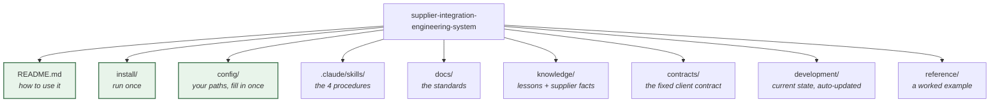

# Developer onboarding

**Give a developer this page and the repository URL. Nothing else.**

Everything below is doable in about twenty minutes, and after it they can start a real supplier
without anyone sitting beside them.

---

## The map — what everything is for

You open the three green boxes. Claude opens the rest.



| Folder | Who opens it | When |
| --- | --- | --- |
| `README.md` · `install/` · `config/` | **You** | Setup, once |
| `.claude/skills/` | Claude | Every command you run |
| `docs/` | Claude | While building — it looks up the rule it needs |
| `contracts/` | Claude | Before mapping anything |
| `knowledge/` | Claude | Reads before, writes after |
| `development/` | Claude writes, **you read** | When you want to know what is blocked |
| `reference/` | Either | To see what good output looks like |

**The point:** you are not expected to learn 30 documents. You learn three commands. The skills
carry the standards to Claude at the moment they apply.

## Part 1 — Setup (once per machine, ~5 minutes)

### 1. Clone the engineering system

```bash
git clone <this-repo-url> <workspace-root>/supplier-integration-engineering-system
```

The path can be anywhere; the rest of this page writes it as `<workspace-root>`.

### 2. Install the skills

```powershell
cd <workspace-root>/supplier-integration-engineering-system
.\install\install.ps1
```

This is the step that makes everything else work, and it is the one people skip.

Claude Code discovers skills from `~/.claude/skills/`. Without this, a developer working in a
*supplier* repository cannot see them — the skills would be sitting in a repo they are not
currently in. The installer creates directory junctions (no administrator rights needed), so
`git pull` here updates the skills everywhere.

### 3. Check it worked

Open Claude Code in **any** folder and type `/`. Four commands should be offered:

```
/supplier-development    route me to the right stage
/supplier-bootstrap      create a new supplier service
/supplier-feature        implement one feature end to end
/aggregator-wiring       wire a feature into the aggregator
```

If they are missing, re-run the installer and restart Claude Code.

### 4. Know where the two other repositories are

Check `config/environment.md` for this installation's paths — the aggregator, the existing
supplier services, and where new work goes. On a fresh clone that file does not exist yet: copy
[`config/environment.example.md`](../config/environment.example.md) to `config/environment.md`
and fill in every `<PLACEHOLDER>`. A developer needs read access to the existing services (as
reference) and write access to the aggregator.

---

## Part 2 — Reading (once, ~15 minutes)

Four documents. Not the whole repository — the rest is looked up when needed.

| Read | Why | Time |
| --- | --- | --- |
| [`README.md`](../README.md) | What this system is and how it is arranged | 3 min |
| **[`docs/permission-boundaries.md`](permission-boundaries.md)** | **What you may not change. Read this one properly.** | 6 min |
| [`contracts/README.md`](../contracts/README.md) | Why the client contract is fixed | 3 min |
| [`docs/branching-and-pr.md`](branching-and-pr.md) | Branch names, paired PRs | 3 min |

**If they read only one thing, make it `permission-boundaries.md`.** Everything else is
recoverable; a change to the shared client contract or the aggregator affects every supplier and
is the one mistake that is expensive.

Later, when relevant — not now:

- [`docs/architecture.md`](architecture.md) — service shape
- [`docs/coding-standards.md`](coding-standards.md) — the canonical feature vocabulary lives here
- [`docs/supplier-patterns.md`](supplier-patterns.md) — auth, protocols, the booking funnel
- [`docs/testing-strategy.md`](testing-strategy.md) — what "tested" means
- [`knowledge/lessons-learned.md`](../knowledge/lessons-learned.md) — fourteen things that already went wrong

The skills tell Claude to read the relevant ones at the relevant moment, so a developer does not
have to remember them.

---

## Part 3 — Doing the work

The system is prompt-driven. A developer describes what they want; the skill supplies the
procedure.

### Starting a new supplier

```
/supplier-bootstrap create the <Supplier> supplier service, short code <XX>, REST/JSON
```

Claude creates the repository, solution, project, five appsettings files, composition root,
extensions, Swagger, DI, middleware, logging, gRPC scaffolding, and **copies the client DTOs from
the aggregator**. It then builds and tests, and shows the output.

Result: a service that builds and runs, with no features.

### Adding a feature

```
/supplier-feature add search to <Supplier>
```

Claude branches from freshly-pulled `staging`, reads the client contract, studies the supplier's
API, raises anything unknown, then builds supplier DTOs → validator → request builder → service →
decomposed mapper → tests, and **runs the real flow to check results actually come back**.

Then:

```
/aggregator-wiring wire <Supplier> search into the aggregator
```

Repeat per feature: Auth → Search → Revalidate → Booking → IssueTicket → the rest. **One at a
time.**

### Not sure which stage

```
/supplier-development I need to integrate <Supplier>
```

---

## Part 4 — What to do when Claude stops and asks

**This is normal and it is the system working**, not a failure. Claude escalates instead of
guessing, because a guess about supplier behaviour ships to production against real money.

An escalation looks like this:

```
Problem:          one sentence - what is blocked
Evidence:         what was checked, with sources
Impact:           what is blocked and what is not
Possible options: 1, 2, 3 - each with its cost
Recommended:      which, and why
Decision required: the one question
```

The developer's job is to answer the last line. Then Claude records it as an ADR in
[`docs/decision-records/`](decision-records/) and continues.

### The three escalations you will actually see

| Escalation | What it means | Who answers |
| --- | --- | --- |
| **"This supplier field has no home in the client contract"** | The interesting one. Options: map into an existing field, drop it, or change the contract. | Team lead / aggregator owner — **never the individual developer alone** |
| **"No sandbox credentials"** | Claude cannot register accounts; signup needs a legal identity and usually 2FA on a phone | The developer, or whoever holds the supplier relationship |
| **"The docs and the API disagree"** | The observed behaviour wins, but someone must confirm | The developer, after checking |

**Never answer an escalation with "just do whatever works".** The escalation exists because
there is a real choice; picking arbitrarily is how an estate of 17 supplier services we analysed
ended up with seventeen different versions of one DTO.

---

## Part 5 — The rules a developer must hold in their head

Three. Everything else Claude enforces from the skills.

### 1. The client contract is not yours to change

The aggregator owns it and every supplier shares it. If a supplier returns something that does
not fit, that is a conversation — never a quiet extra field.

### 2. The aggregator takes wiring only

You may add a supplier to lists that already exist. You may not add business logic, new
abstractions, endpoints, or DTO fields there. A supplier that does not fit is a finding about the
supplier, not a licence to change shared code.

### 3. Done means observed

Tests run with output shown, and the real flow driven and seen to work. "It compiles" is not
done. Claude is instructed to report honestly; hold it to that, and check the PR contains actual
test output.

---

## Part 6 — Where things get written down

The developer does not maintain these by hand — Claude updates them as part of the work. Know
where to look:

| File | Holds |
| --- | --- |
| [`development/active-supplier.md`](../development/active-supplier.md) | What is being worked on right now, and what is blocked |
| [`development/progress.md`](../development/progress.md) | Running history and open questions |
| `knowledge/suppliers/<supplier>.md` | Everything learned about that supplier's API |
| [`docs/decision-records/`](decision-records/) | Every decision and why |
| [`development/readiness.md`](../development/readiness.md) | **What this system has and has not proven** |

If a discovery lives only in a chat log, it is lost. That is the point of these files.

---

## Troubleshooting

| Symptom | Fix |
| --- | --- |
| Slash commands not offered | Re-run `install\install.ps1`, restart Claude Code |
| Claude edits the client contract | Stop it. Point at `docs/permission-boundaries.md`. That change needs an ADR. |
| Claude adds logic to the aggregator | Same. The wiring surface is listed in `docs/permission-boundaries.md`; this installation's paths for it are in `config/environment.md`. |
| Claude says a feature is done without showing test output | Not done. The definition of done requires executed tests with visible output. |
| Claude invents supplier behaviour | Point at `docs/human-intervention.md` — it should have escalated. |
| Skills seem out of date | `git pull` in the engineering-system repo; junctions update automatically |

---

## Honest limits

Before relying on this, read [`development/readiness.md`](../development/readiness.md). Summary:

- **Works well:** REST/JSON supplier, read path (search, retrieve). Proven — the reference
  builds and its tests pass.
- **Thinner:** the write path (Booking, IssueTicket) has documented rules but **no worked
  example in code**, and SOAP suppliers get the standards but no scaffold.
- **Unproven:** no supplier has yet been taken end-to-end against a live API with this system.

Tell developers that. A system that oversells itself gets trusted in exactly the places it should
not be.
